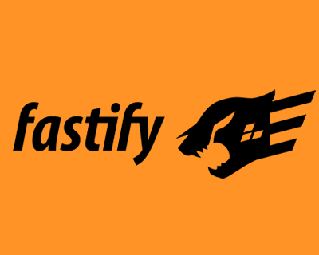

  

###

  
  
  

###

  

###

<h1 align="center">hey there 👋</h1>

###

<h3 align="left">👩‍💻  About Me</h3>

###

✨ Creating bugs since 2022 📚 I'm currently learning Java and Spring 🯠Goals: Backend Development 🲠Fun fact: I started with Mysql

###

<h3 align="left">🛠 Language and tools</h3>

###

  
  
  
  
  
  
  
  
  
  
  
  
  
  
  
  

###

<!--
<h3 align="left">🔥   My Stats :</h3>

###

  

###
-->
